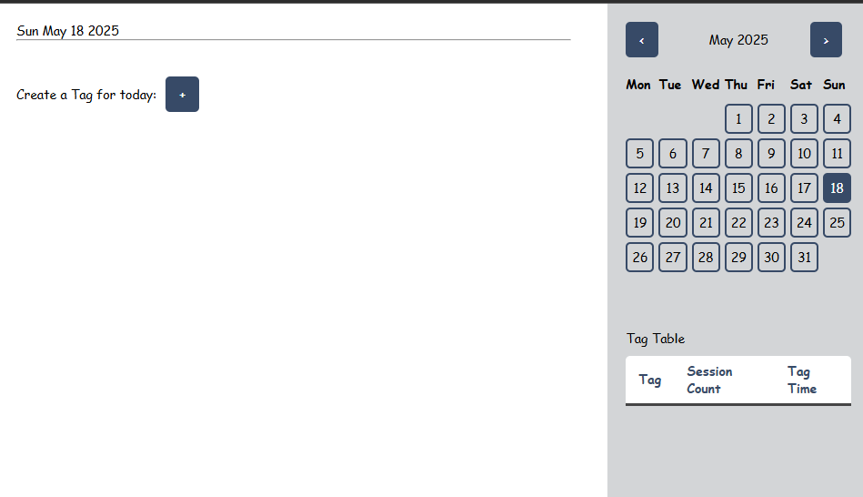
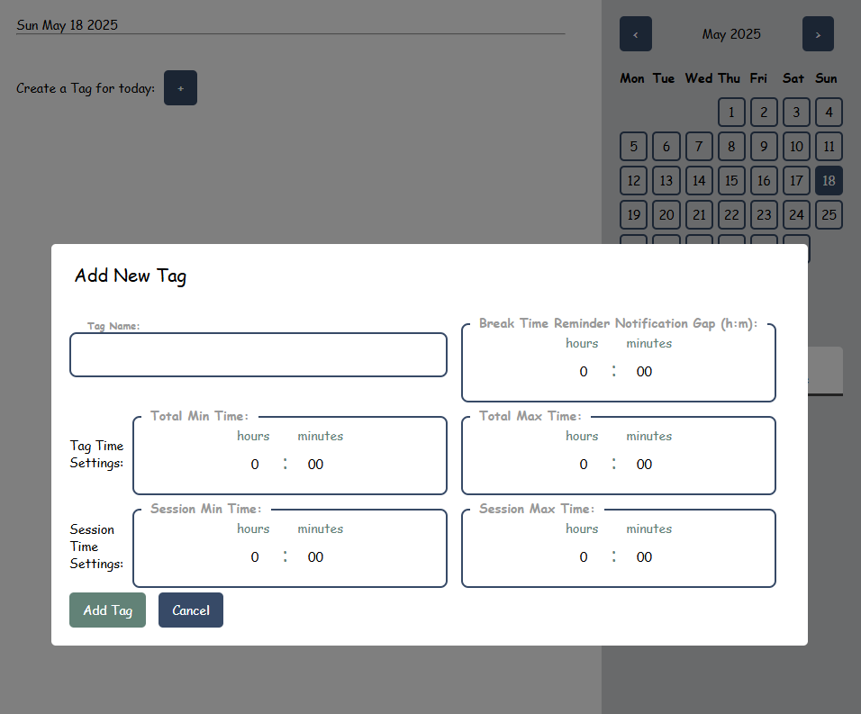
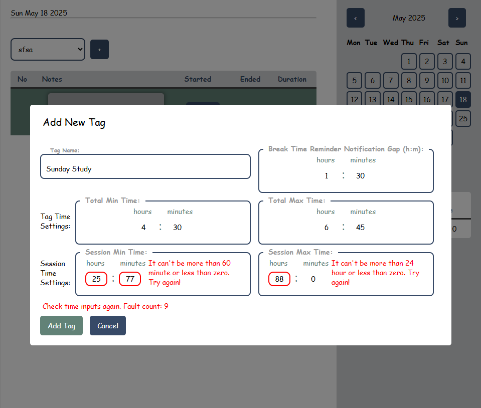
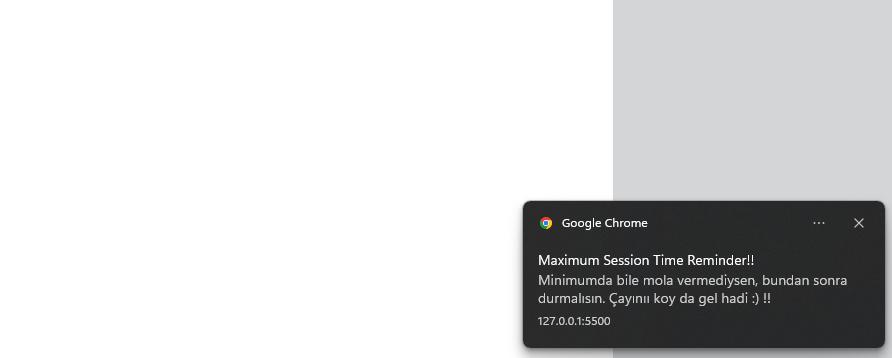
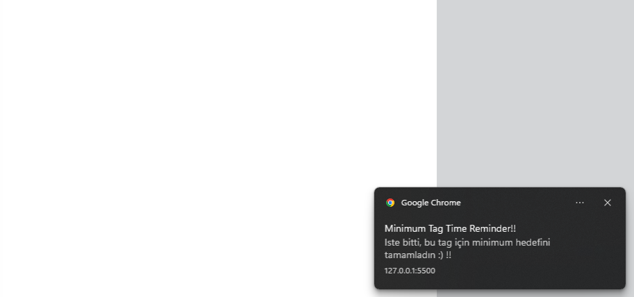
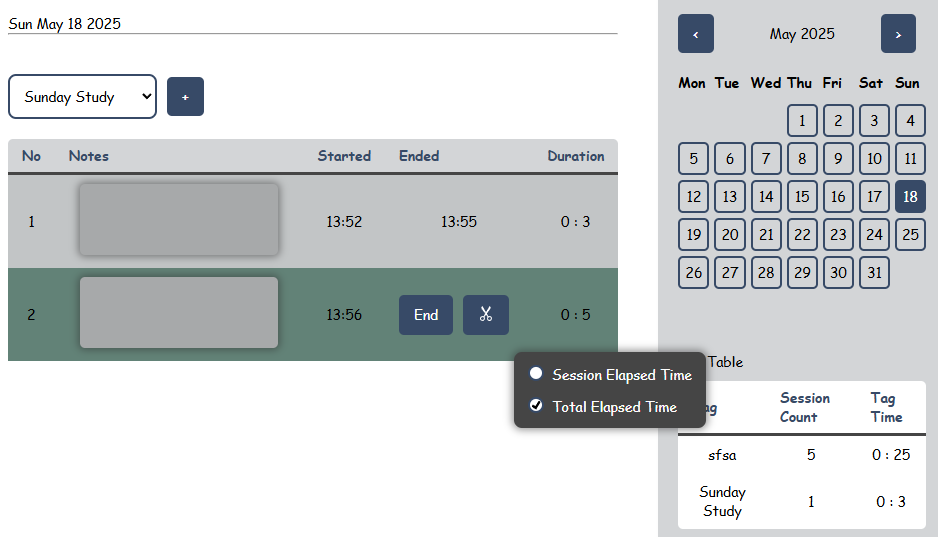
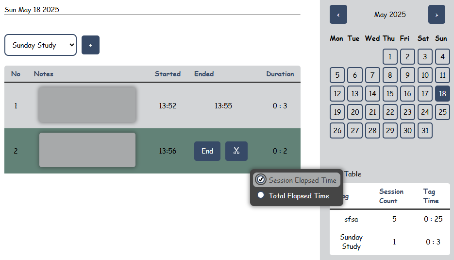

# MissionTimer ⏱️

> A web-based task timer with notification reminders.  
> Web tabanlı bildirim hatırlatmalı görev zamanlayıcısı.

---

## 🌍 Live Demo / Canlı Demo

🔗 [https://iskburcin.github.io/MissionTimer/](https://iskburcin.github.io/MissionTimer/)

---

## 📌 Features / Özellikler

- **⏱️ Session Tracking** – Track how long you’ve been working on a task by saving start and end time.  
  **⏱️ Oturum Takibi** – Her görev üzerinde oturumlar başlatıp ne kadar çalıştığınızı başlangiç ve bitiş zamanlarını kaydederek takip edin.

- **📛 Tag-Based System** – Create Tasks for certain dates and customize them with tags.  
  **📛 Etiket Sistemi** – Belirli tarihler için görevler oluşturabilir,ve onları etiketlerle özelleştirilebilirsin.

- **🔔 Notification Reminders** – Get alerts for break times, session limits, and progress.  
  **🔔 Bildirim Hatırlatmaları** – Mola zamanları, oturum süreleri ve ilerleme için uyarılar alın.

- **🧠 Local Storage** – All data is saved locally in your browser for now.  
  **🧠 Yerel Saklama** – Tüm veriler tarayıcıda yerel olarak saklanır şimdilik.

- **📊 Auto-Calculation** – Automatically sums up durations of your sessions, tasks.  
  **📊 Otomatik Hesaplama** – Oturum ve görev sürelerinizi otomatik olarak toplar.

- **Right-click on session rows** in the table body to open a context menu:

  - You can eventually **delete** or **edit** (🛠️ under development) that specific session row.
  - If you **right-click on the last row**, which starts a new session (only if a session is active),  
    you’ll see how much time has passed or check the **total task time**.

- Oturum tablosunun **gövde kısmındaki satırlara sağ tıklarsanız**, bağlam menüsü açılır :
  - Bu menüden o satırı **silme** ya da **düzenleme**(🛠️ geliştirme aşamasında) işlemleri yapılabilir.
  - Eğer **son satıra sağ tıklarsanız** (yeni bir oturum başlamış olmalı!),
    o ana kadar geçen süreyi veya **toplam görev süresini** görebilirsiniz.

---

## 🚀 Usage / Kullanım

- Open the [Live Website](https://iskburcin.github.io/MissionTimer/) and start tracking your sessions.  
  [Canlı Siteyi Açın](https://iskburcin.github.io/MissionTimer/) ve oturumlarınızı takip etmeye başlayın.

- Create a new **tag**, start a **session**, and track your **daily work**.  
  Yeni bir **etiket** oluşturun, bir **oturum** başlatın ve günlük çalışmanızı takip edin.

- Enable **notifications** when prompted to receive reminders.  
  Hatırlatıcılar alabilmek için **bildirimlere izin verin**.

---

## 🧱 Architecture / Mimarisi

- **Pure JavaScript** is used for all logic and interactions.  
  **Tüm işlevsellik ve etkileşim** js ile yazılmıştır.

- Uses **localStorage** for data persistence without a backend.  
  Sunucusuz veri saklama için **localStorage** kullanır.

- Notification system is built using the **Web Notification API**.  
  Bildirim sistemi **Web Notification API** ile yazılmıştır.

- Time tracking is handled via custom intervals using `setInterval()` and dynamic session logic.  
  Zaman takibi `setInterval()` ile yapılır ve oturum kontrolü dinamik olarak gerçekleştirilir.

---

## 🖼️ Screenshots / Ekran Görüntüleri

- 🏠 **Homepage / Ana Sayfa:**  
  

- 🏷️ **Tag Form / Etiket Ekleme Formu:**  
  
  

- 🔔 **Notification Panel / Bildirim Paneli:**  
  
  

- 🔔 **Right Click Menu / Sağ Tık Menüsü:**  
  
  

---

## 🔮 Planned Features / Planlanan Özellikler

- 🍅 **Pomodoro Mode:** Timed 25+5 sessions for focused productivity.  
  **Pomodoro Modu:** 25+5 zamanlı odaklı çalışma oturumları.

- 🔁 **Recurring Tasks:** Define weekly/daily repeating tasks automatically.  
  **Yinelenen Görevler:** Günlük veya haftalık tekrar eden görev tanımı.

- ⚙️ **Tag Settings Panel:** Change timing limits of existing tags.  
  **Etiket Ayarları Paneli:** Var olan etiketlerin süre ayarlarını güncelleme.

- 🎨 **Themes:** Light/Dark mode and customizable themes.  
  **Tema Seçimi:** Açık/Koyu mod ve özelleştirilebilir temalar.

- 🕰️ **12h / 24h Switch:** Toggle between AM/PM and 24-hour format.  
  **12/24 Saat Seçici:** AM/PM ve 24 saat görünümü arasında geçiş.

- 📈 **Data Visualization:** Graphs to show daily/weekly productivity trends.  
  **Veri Görselleştirme:** Günlük/haftalık verimlilik trendlerini grafiklerle gösterme.

- 🧭 **Time Zone Awareness:** Accurate time tracking for international users.  
  **Zaman Dilimi Desteği:** Uluslararası kullanıcılar için doğru zaman takibi.
- **Right click edit feature**
  **Sağ tık düzenleme özelliği**
